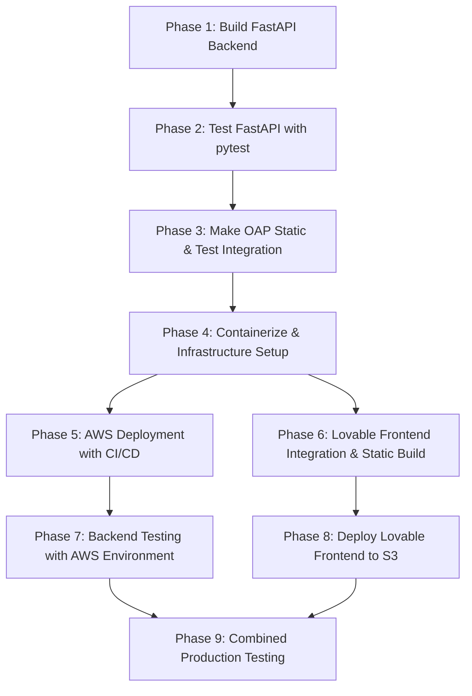

# Aura Agentic Studio & ARC Migration & Deployment Plan

**Date Created:** 2025-11-15  
**Updated:** 2025-11-20  
**Status:** In Progress - Phases 4-9 (parallel execution)  
**Objective:** Migrate OAP from Next.js monorepo to static frontend + FastAPI backend architecture, integrate Lovable frontend, and deploy to AWS with infrastructure-as-code and CI/CD automation for production readiness

---

## Table of Contents

1. [Executive Summary](#executive-summary)
2. [✅ Phase 1: Build FastAPI Backend](#phase-1-build-fastapi-backend) - COMPLETE
3. [✅ Phase 2: Test FastAPI with pytest](#phase-2-test-fastapi-with-pytest) - COMPLETE
4. [✅ Phase 3: Make OAP Static & Test Integration](#phase-3-make-oap-static--test-integration) - COMPLETE
5. [Phase 4: Containerize & Infrastructure Setup](#phase-4-containerize--infrastructure-setup) - IN PROGRESS
6. [Phase 5: AWS Deployment with CI/CD](#phase-5-aws-deployment-with-cicd) - IN PROGRESS
7. [Phase 6: Lovable Frontend Integration & Static Build](#phase-6-lovable-frontend-integration--static-build) - IN PROGRESS
8. [Phase 7: Backend Testing with AWS Environment](#phase-7-backend-testing-with-aws-environment)
9. [Phase 8: Deploy Lovable Frontend to S3](#phase-8-deploy-lovable-frontend-to-s3)
10. [Phase 9: Combined Production Testing](#phase-9-combined-production-testing)
11. [Success Criteria](#success-criteria)
12. [Risk Mitigation](#risk-mitigation)

---

## Executive Summary


This plan outlines the decomposition of Open Agent Platform (OAP) from a Next.js monorepo into a clean separation of concerns:

- **Backend:** Standalone FastAPI application (deployed on AWS ECS Fargate)
- **Frontend:** Static Vite SPA (deployed to CloudFront CDN)

Original Architecture:

<figure class="image op-uc-figure"><div class="op-uc-figure--content"></div></figure>

New Architecture:

<figure class="image op-uc-figure"><div class="op-uc-figure--content"></div></figure>


**Key Benefits:**
- ✅ Backend can be developed and tested independently
- ✅ Backend is containerized and production-ready for AWS ECS Fargate
- ✅ Smaller frontend bundle (no server runtime)
- ✅ Independent scaling of frontend/backend
- ✅ Reusable backend for Aura and future frontends
- ✅ Clear separation of concerns

**Execution Order (Updated 2025-01-18):**
1. ✅ Build FastAPI backend (no frontend needed)
2. ✅ Test backend with pytest (41 tests passing, 88% coverage)
3. 🎯 Convert OAP frontend to static & test integration locally
4. Containerize for AWS ECS Fargate (after validating integration works)
5. Deploy to production & final testing

**Why Test Integration Before Containerization:**
- Validate API routes work with real frontend before Docker/AWS investment
- Fast feedback loop (no container rebuilds)
- Catch CORS, auth, and streaming issues early
- Fix integration problems locally, then package what works

### Execution Flow

Starting from Phase 4, work proceeds in parallel across two streams that merge at Phase 9:



---

## Phase 1: Build FastAPI Backend ✅ COMPLETE

**Status:** ✅ Complete (2025-01-18)  
**Location:** `/arc_fastapi_backend/`  
**Documentation:** See `arc_fastapi_backend/README.md`

### 1.1 Overview

Build a complete, production-ready FastAPI backend that implements all OAP API functionality. This phase focuses on core backend development with zero frontend dependencies.

**Why Build Backend First:**
- ✅ Can test all endpoints with pytest (no frontend needed)
- ✅ Can deploy backend independently to AWS ECS
- ✅ Backend becomes reusable for multiple frontends
- ✅ Allows frontend developers to work in parallel
- ✅ Faster feedback loop (pytest runs in seconds)

### 1.2 FastAPI Project Structure

```
fastapi-backend/
├── main.py                          # Entry point
├── requirements.txt                 # Dependencies
├── requirements-dev.txt             # Dev dependencies (pytest, etc)
├── .env                             # Configuration
├── .env.example
├── Dockerfile                       # AWS ECS container image
├── docker-compose.yml               # Local testing
│
├── config.py                        # Environment & deployment config
├── auth/
│   ├── __init__.py
│   ├── middleware.py                # Supabase token validation
│   └── models.py                    # Auth schemas
│
├── api/
│   ├── __init__.py
│   ├── langgraph/
│   │   ├── __init__.py
│   │   ├── proxy.py                 # Pass-through to LangGraph
│   │   ├── defaults.py              # Get/create default assistants
│   │   └── routes.py                # Main endpoint handlers
│   │
│   ├── mcp/
│   │   ├── __init__.py
│   │   ├── proxy.py                 # MCP server proxy
│   │   └── routes.py                # MCP endpoints
│   │
│   └── health/
│       └── routes.py                # Health check endpoints
│
├── services/
│   ├── __init__.py
│   ├── langgraph_client.py          # LangGraph SDK wrapper
│   ├── mcp_service.py               # MCP operations
│   └── deployment_service.py        # Deployment management
│
├── utils/
│   ├── __init__.py
│   ├── logger.py                    # Logging configuration
│   ├── errors.py                    # Error handling
│   └── helpers.py                   # Utility functions
│
└── tests/
    ├── __init__.py
    ├── conftest.py                  # pytest fixtures
    ├── test_auth.py
    ├── test_langgraph.py
    ├── test_mcp.py
    └── test_e2e.py
```

### 1.3 Core Dependencies

**File: `requirements.txt`**
```
fastapi==0.104.1
uvicorn[standard]==0.24.0
python-dotenv==1.0.0
pydantic==2.5.0
pydantic-settings==2.1.0

# LangGraph
langchain-langgraph==0.0.85
langchain-core==0.1.30

# Supabase (for token validation)
supabase==2.3.4

# HTTP client
httpx==0.25.1

# JWT for token validation
pyjwt==2.8.1

# Logging
python-json-logger==2.0.7
```

**File: `requirements-dev.txt`**
```
-r requirements.txt

# Testing
pytest==7.4.3
pytest-asyncio==0.21.1
pytest-httpx==0.25.0

# Linting & formatting
black==23.12.0
flake8==6.1.0
mypy==1.7.1
```

### 1.4 Main Entry Point

**File: `main.py`**
```python
from fastapi import FastAPI
from fastapi.middleware.cors import CORSMiddleware
import uvicorn
import logging
from dotenv import load_dotenv

from config import settings
from api.langgraph import routes as lg_routes
from api.mcp import routes as mcp_routes
from api.health import routes as health_routes

# Load environment variables
load_dotenv()

# Setup logging
logging.basicConfig(level=logging.INFO)
logger = logging.getLogger(__name__)

# Create app
app = FastAPI(
    title="OAP Backend API",
    description="FastAPI backend for Open Agent Platform",
    version="1.0.0",
)

# Add CORS middleware
app.add_middleware(
    CORSMiddleware,
    allow_origins=settings.CORS_ORIGINS,
    allow_credentials=True,
    allow_methods=["*"],
    allow_headers=["*"],
)

# Include routers
app.include_router(health_routes.router, prefix="/health", tags=["health"])
app.include_router(lg_routes.router, prefix="/api/langgraph", tags=["langgraph"])
app.include_router(mcp_routes.router, prefix="/api/mcp", tags=["mcp"])

@app.on_event("startup")
async def startup_event():
    logger.info("OAP Backend API starting up")
    # Validate deployments on startup
    if not settings.deployments:
        logger.warning("No deployments configured - check NEXT_PUBLIC_DEPLOYMENTS")

@app.on_event("shutdown")
async def shutdown_event():
    logger.info("OAP Backend API shutting down")

if __name__ == "__main__":
    uvicorn.run(
        "main:app",
        host=settings.HOST,
        port=settings.PORT,
        reload=settings.DEBUG,
        workers=settings.WORKERS if not settings.DEBUG else 1,
        log_level="info",
    )
```

### 1.5 Configuration

**File: `config.py`**
```python
from pydantic_settings import BaseSettings
from typing import List
import json

class Settings(BaseSettings):
    # FastAPI
    HOST: str = "0.0.0.0"
    PORT: int = 8000
    DEBUG: bool = False
    WORKERS: int = 4
    
    # CORS - allow multiple origins for development/staging/production
    CORS_ORIGINS: List[str] = [
        "http://localhost:3000",
        "http://localhost:5173",
        "http://localhost:8080",
    ]
    
    # LangGraph
    LANGSMITH_API_KEY: str
    NEXT_PUBLIC_DEPLOYMENTS: str  # JSON string
    
    # Supabase
    SUPABASE_URL: str
    SUPABASE_JWT_SECRET: str
    SUPABASE_ANON_KEY: str
    
    # MCP Server
    MCP_SERVER_URL: str | None = None
    MCP_AUTH_REQUIRED: bool = False
    MCP_TOKENS: str | None = None
    
    # AWS/Deployment
    ENVIRONMENT: str = "development"  # development, staging, production
    
    class Config:
        env_file = ".env"
        case_sensitive = True
    
    @property
    def deployments(self):
        """Parse NEXT_PUBLIC_DEPLOYMENTS JSON"""
        if not self.NEXT_PUBLIC_DEPLOYMENTS:
            return []
        try:
            return json.loads(self.NEXT_PUBLIC_DEPLOYMENTS)
        except json.JSONDecodeError:
            raise ValueError("Invalid JSON in NEXT_PUBLIC_DEPLOYMENTS")

settings = Settings()
```

**File: `.env.example`**
```env
# FastAPI Configuration
HOST=0.0.0.0
PORT=8000
DEBUG=False
WORKERS=4
ENVIRONMENT=development

# CORS (comma-separated for production)
CORS_ORIGINS=http://localhost:3000,http://localhost:5173,https://aura.example.com

# LangGraph
LANGSMITH_API_KEY=your_langsmith_api_key
NEXT_PUBLIC_DEPLOYMENTS=[{"id":"deployment-id","deploymentUrl":"https://langgraph.example.com","tenantId":"tenant-id","name":"My Deployment","isDefault":true,"defaultGraphId":"graph-id"}]

# Supabase
SUPABASE_URL=https://your-project.supabase.co
SUPABASE_JWT_SECRET=your_jwt_secret
SUPABASE_ANON_KEY=your_anon_key

# MCP Server (optional)
MCP_SERVER_URL=http://localhost:8001
MCP_AUTH_REQUIRED=false
MCP_TOKENS={"access_token":"..."}
```

### 1.6 Implementation Checklist

- [x] Create `arc_fastapi_backend/` directory
- [x] Set up project structure (folders, __init__.py files)
- [x] Implement `main.py` entry point
- [x] Implement `config.py` settings management
- [x] Implement `api/langgraph/routes.py` (LangGraph proxy)
- [x] Implement `api/langgraph/defaults.py` (Defaults logic)
- [x] Implement `api/mcp/routes.py` (MCP proxy)
- [x] Implement `services/langgraph_client.py` (SDK wrapper)
- [x] Implement `services/mcp_service.py` (MCP operations)
- [x] Implement `auth/middleware.py` (Token validation)
- [x] Implement `api/health/routes.py` (Health checks)
- [x] Create `env.example`
- [x] Create `pyproject.toml` with uv package manager

**Result:** All endpoints implemented and functional. See README for API documentation.

---

## Phase 2: Test FastAPI with pytest ✅ COMPLETE

**Status:** ✅ Complete (2025-01-18)  
**Test Results:** 41/41 tests passing (100% pass rate)  
**Coverage:** 88% (exceeds 80% requirement)  
**Documentation:** See `arc_fastapi_backend/dev_log/PHASE2_VERIFICATION.md`

### 2.1 Testing Strategy

Test the FastAPI backend **independently** without needing the OAP frontend.

### 2.2 Unit Tests

**File: `tests/test_auth.py`**
```python
import pytest
from auth.middleware import validate_supabase_token
from fastapi import HTTPException

@pytest.mark.asyncio
async def test_valid_token():
    """Test valid JWT token is accepted"""
    valid_token = create_test_jwt_token({"sub": "user123"})
    payload = await validate_supabase_token(valid_token)
    assert payload["sub"] == "user123"

@pytest.mark.asyncio
async def test_expired_token():
    """Test expired token is rejected"""
    expired_token = create_expired_jwt_token()
    with pytest.raises(HTTPException) as exc:
        await validate_supabase_token(expired_token)
    assert exc.value.status_code == 401

@pytest.mark.asyncio
async def test_invalid_token():
    """Test invalid token is rejected"""
    with pytest.raises(HTTPException):
        await validate_supabase_token("invalid.token.here")
```

**File: `tests/test_langgraph.py`**
```python
import pytest
from fastapi.testclient import TestClient
from main import app

client = TestClient(app)

def test_langgraph_proxy_requires_auth():
    """Test LangGraph proxy requires authentication"""
    response = client.get("/api/langgraph/proxy/deployment-id/threads")
    assert response.status_code == 401

def test_langgraph_proxy_with_valid_token(valid_token):
    """Test LangGraph proxy with valid token"""
    response = client.get(
        "/api/langgraph/proxy/deployment-id/threads",
        headers={"Authorization": f"Bearer {valid_token}"}
    )
    # Should either succeed or return proper error (not 401)
    assert response.status_code in [200, 400, 404, 500]

def test_langgraph_defaults_requires_deployment_id(valid_token):
    """Test defaults endpoint requires deployment_id parameter"""
    response = client.get(
        "/api/langgraph/defaults",
        headers={"Authorization": f"Bearer {valid_token}"}
    )
    assert response.status_code == 400
```

**File: `tests/test_mcp.py`**
```python
import pytest
from fastapi.testclient import TestClient
from main import app

client = TestClient(app)

def test_mcp_proxy_requires_auth():
    """Test MCP proxy requires authentication"""
    response = client.get("/api/mcp/tools")
    # Should return 401 or 403 depending on MCP_AUTH_REQUIRED
    assert response.status_code in [200, 401, 403]

def test_health_check():
    """Test health check endpoint"""
    response = client.get("/health")
    assert response.status_code == 200
    assert response.json()["status"] == "healthy"
```

### 2.3 Integration Tests

**File: `tests/test_e2e.py`**
```python
import pytest
from fastapi.testclient import TestClient
from main import app

client = TestClient(app)

@pytest.mark.asyncio
async def test_full_workflow_requires_valid_token():
    """
    Test that endpoints enforce authentication properly
    """
    # Without token - should fail
    response = client.get("/api/langgraph/proxy/deployment-id/threads")
    assert response.status_code == 401
    
    # With valid token - should work or fail gracefully
    token = get_valid_test_token()
    response = client.get(
        "/api/langgraph/proxy/deployment-id/threads",
        headers={"Authorization": f"Bearer {token}"}
    )
    assert response.status_code in [200, 400, 404, 500, 502]  # Any response but not 401

def test_cors_headers_present():
    """Test CORS headers are present in response"""
    response = client.get("/health")
    assert "access-control-allow-origin" in response.headers
```

### 2.4 Running Tests

```bash
# Install dev dependencies
pip install -r requirements-dev.txt

# Run all tests
pytest tests/ -v

# Run with coverage
pytest tests/ --cov=. --cov-report=html

# Run specific test file
pytest tests/test_auth.py -v

# Run in watch mode (if using pytest-watch)
ptw tests/
```

### 2.5 Testing Checklist

- [x] Create `tests/conftest.py` with fixtures
- [x] Create `tests/test_auth.py` (auth validation tests) - 6 tests
- [x] Create `tests/test_langgraph.py` (LangGraph proxy tests) - 5 tests
- [x] Create `tests/test_langgraph_defaults.py` (defaults tests) - 5 tests
- [x] Create `tests/test_mcp.py` (MCP proxy tests) - 6 tests
- [x] Create `tests/test_health.py` (health check tests) - 3 tests
- [x] Create `tests/test_e2e.py` (end-to-end tests) - 16 tests
- [x] All tests pass locally - **41/41 passing**
- [x] Code coverage > 80% - **88% achieved**
- [x] No hardcoded credentials in tests - **Security audit passed**

**Result:** Comprehensive test suite with mock-based integration tests. Ready for real integration testing.

---

## Phase 3: Make OAP Static & Test Integration ✅ COMPLETE

**Status:** ✅ Complete (2025-11-20)  
**Documentation:** See `dev_log/7_E2E_TESTING_REPORT.md` for full test results  
**Rationale:** Test integration locally before containerization to validate the core migration works

### 3.1 Overview

Convert OAP's Next.js app to a static SPA and test integration with the FastAPI backend locally. This validates the migration before investing in Docker/AWS deployment.

**Why This Order:**
- ✅ Validates API routes work with real frontend
- ✅ Fast feedback loop (no container rebuilds)
- ✅ Catches CORS, authentication, and streaming issues early
- ✅ Fix integration problems locally before packaging
- ✅ Once working locally, containerization is just packaging

### 3.2 Step-by-Step: Convert OAP to Static

#### Step 3.2.1: Identify Current OAP Location

The current OAP web app is at `arc_static_frontend/apps/web/` (Next.js 15.3.1 application).

#### Step 3.2.2: Configure Build Output

**File: `arc_static_frontend/apps/web/next.config.mjs`**
```javascript
/** @type {import('next').NextConfig} */
const nextConfig = {
  // Export as static site (no server needed)
  output: 'export',
  
  // Use trailing slashes for better static hosting
  trailingSlash: true,
  
  // Optimize images for static export
  images: {
    unoptimized: true,
  },
};

export default nextConfig;
```

#### Step 3.2.3: Remove Server-Only Code

**Delete these files/directories:**
```
- src/app/api/                    (all API routes - replaced by FastAPI)
- src/middleware.ts               (Next.js middleware)
- src/lib/auth/middleware.ts      (auth middleware - now in FastAPI)
- src/app/debug-auth/             (debug route)
```

#### Step 3.2.4: Update API Route References

Find all places where the frontend calls API routes and update them to use the FastAPI backend:

**Current (Next.js API routes):**
```typescript
// Calls to /api/langgraph/*, /api/oap_mcp/*, etc.
fetch('/api/langgraph/proxy/...')
```

**New (FastAPI backend):**
```typescript
// Create a helper function
const getApiBaseUrl = () => {
  return process.env.NEXT_PUBLIC_BASE_API_URL || 'http://localhost:8000';
};

// Use it in API calls
fetch(`${getApiBaseUrl()}/api/langgraph/proxy/...`)
```

**Environment Configuration:**
```env
# .env.local (development)
NEXT_PUBLIC_BASE_API_URL=http://localhost:8000

# .env.production (production)
NEXT_PUBLIC_BASE_API_URL=https://api.yourdomain.com
```

#### Step 3.2.5: Local Integration Testing

```bash
# Terminal 1: Start FastAPI backend
cd arc_fastapi_backend
uv run uvicorn main:app --reload --port 8000

# Terminal 2: Start frontend dev server
cd arc_static_frontend/apps/web
npm run dev

# Test all features:
# - Sign in / Sign up
# - Create agent
# - Chat with agent
# - Use tools
# - RAG functionality
# - MCP tools
```

#### Step 3.2.6: Build & Verify Static Export

```bash
# Build as static site
cd arc_static_frontend/apps/web
npm run build

# Verify output is pure static
ls -la out/   # Next.js exports to 'out/' directory

# Test static build locally
npx serve -s out -l 3000

# With backend running:
cd arc_fastapi_backend
uv run uvicorn main:app --reload --port 8000
```

### 3.3 Frontend Integration Checklist

- [x] Configure `next.config.mjs` for static export
- [x] Create `getApiBaseUrl()` helper function
- [x] Update all API calls to use FastAPI backend
- [x] Delete API routes: `src/app/api/`
- [x] Delete Next.js middleware: `src/middleware.ts`
- [x] Delete auth middleware: `src/lib/auth/middleware.ts`
- [x] Delete debug route: `src/app/debug-auth/`
- [x] Update environment variables
- [x] Test locally: Backend (8000) + Frontend dev (3000)
- [x] Verify all features work:
  - [x] Authentication (sign in/up, token validation)
  - [x] Agent creation and management
  - [x] Chat with streaming responses
  - [x] Tool execution
  - [x] RAG functionality
  - [x] MCP tool integration (fixed OAuth token exchange)
- [x] Build successfully: `npm run build`
- [x] Verify `out/` contains only static files
- [x] Test static build with `npx serve`

### 3.4 Integration Test Results

**Status:** ✅ Complete (2025-11-20)  
**Full Report:** See `dev_log/7_E2E_TESTING_REPORT.md`

**API Endpoints:**
- [x] Health check works
- [x] LangGraph proxy works
- [x] LangGraph defaults works
- [x] MCP proxy works
- [x] CORS headers correct
- [x] Authentication flow works
- [x] Streaming responses work

**Frontend Features:**
- [x] Sign in / Sign up works
- [x] Agent dashboard loads
- [x] Create/edit agents works
- [x] Chat interface works
- [x] Streaming messages render
- [x] Tools execute correctly
- [x] RAG collections work
- [x] MCP tools work

**Issues Found:**
- ⚠️ **MCP Agent Performance:** Agents with MCP tools have slow response times (~1 minute). Authentication and functionality work correctly, but performance optimization needed. Marked as backlog. See `dev_log/6_PERFORMANCE_INVESTIGATION_AND_DEVELOPMENT_WORKFLOW.md` for investigation details.

### 3.5 Reverse Proxy for Same-Origin Deployment

**Problem:** Cross-origin cookie limitations prevented MCP session state persistence. Backend (`localhost:8000`) and frontend (`localhost:3000`) are different origins, so cookies set by backend cannot be read by frontend, causing each request to create a new MCP session.

**Solution:** Implemented nginx reverse proxy to serve both frontend and backend on same origin (`localhost:3100`):
- Frontend: `localhost:3100/` → `localhost:3000`
- Backend: `localhost:3100/api/` → `localhost:8000`
- Cookies work automatically (same-origin)
- MCP session state persists correctly

**Implementation:**
- Created `arc_static_frontend/arc_nginx_test/` with nginx configuration
- Updated `getBaseApiUrl()` to detect proxy and use relative URLs
- Validated MCP session persistence works with same-origin setup

**Production:** AWS CloudFront will replace nginx, serving frontend (S3) and backend (ALB) on same origin. Code is production-ready - no changes needed.

**Documentation:** See `dev_log/4_MCP_AUTH_AND_PROXY_DEBUGGING.md` for detailed analysis and `arc_nginx_test/README.md` for setup.

**Summary:** All critical functionality verified and working. Phase 3 ready for Phase 4 (Containerization).

---

## Phase 4: Containerize & Infrastructure Setup

**Status:** ⏳ In Progress  
**Can Execute In Parallel With:** Phase 6 (Lovable Frontend Integration)

### 4.1 Overview

This phase focuses on containerizing the FastAPI backend and setting up infrastructure-as-code using AWS CDK. This enables automated deployment and reduces manual infrastructure management.

**Key Objectives:**
- Containerize FastAPI backend with Docker
- Set up AWS CDK infrastructure code
- Define all AWS resources as code (ECR, ECS, ALB, CloudFront, S3)
- Enable infrastructure versioning and reproducibility

### 4.2 Docker Containerization

#### 4.2.1 Create Dockerfile

**Tasks:**
- Create multi-stage `Dockerfile` for optimized image size
- Use `python:3.11-slim` as base image
- Configure non-root user for security
- Set up health check endpoint
- Ensure graceful shutdown (SIGTERM handling)
- Optimize layer caching for faster builds

**Requirements:**
- Image size < 500MB
- Security best practices (non-root user, minimal attack surface)
- Health check compatible with ECS

#### 4.2.2 Create Docker Compose Configuration

**Tasks:**
- Create `docker-compose.yml` for local testing
- Configure environment variables
- Set up networking for container communication
- Optional: Mock MCP server for local testing

**Purpose:**
- Test containerized backend locally before AWS deployment
- Validate Docker image works correctly
- Enable local development with containers

#### 4.2.3 Local Docker Testing

**Tasks:**
- Build Docker image locally
- Test container runs successfully
- Verify health check endpoint works
- Test graceful shutdown behavior
- Validate image size meets requirements
- Run integration tests inside container

### 4.3 AWS CDK Infrastructure Setup

#### 4.3.1 Initialize CDK Project

**Tasks:**
- Create `arc_fastapi_backend/infrastructure/` directory
- Initialize CDK project with TypeScript or Python
- Set up CDK project structure and configuration
- Configure CDK context and environment variables

**Location:**
- CDK code in `arc_fastapi_backend/infrastructure/cdk/`

#### 4.3.2 Define Infrastructure Stacks

**Backend Stack (ECS Fargate):**
- ECR repository for Docker images
- ECS Fargate cluster configuration
- ECS service definition
- Task definition with resource limits
- Application Load Balancer (ALB)
- Target groups for ECS service
- Security groups for network access
- CloudWatch log groups

**Frontend Stack (S3 + CloudFront):**
- S3 bucket for static frontend hosting
- CloudFront distribution
- CloudFront origin access control
- Cache policies and behaviors
- Path-based routing (`/` → S3, `/api/*` → ALB)

**Network Stack (Optional):**
- VPC configuration (if custom VPC needed)
- Subnets for ECS tasks
- Internet Gateway / NAT Gateway
- Route tables

**Secrets & Configuration:**
- AWS Secrets Manager secrets for environment variables
- IAM roles for ECS task execution
- IAM policies for service access

#### 4.3.3 CDK Constructs

**Tasks:**
- Create reusable constructs for common patterns
- FastAPI ECS service construct
- CloudFront + S3 static site construct
- Secrets management construct

**Benefits:**
- Code reusability
- Consistent infrastructure patterns
- Easier maintenance and updates

#### 4.3.4 CDK Deployment Testing

**Tasks:**
- Deploy CDK stacks to dev/staging environment
- Validate all resources created correctly
- Test infrastructure configuration
- Verify connectivity between resources
- Test rollback procedures

### 4.4 Containerization Checklist

- [ ] Create `Dockerfile` (multi-stage, non-root user, health check)
- [ ] Create `docker-compose.yml` for local testing
- [ ] Build Docker image locally: `docker build -t oap-backend .`
- [ ] Test health endpoint in container
- [ ] Test image size < 500MB
- [ ] Initialize CDK project in `infrastructure/cdk/`
- [ ] Define backend stack (ECR, ECS, ALB)
- [ ] Define frontend stack (S3, CloudFront)
- [ ] Define network stack (if needed)
- [ ] Create reusable CDK constructs
- [ ] Test CDK deployment to dev/staging environment
- [ ] Validate infrastructure configuration

---

## Phase 5: AWS Deployment with CI/CD

**Status:** ⏳ In Progress  
**Prerequisites:** Phase 4 (Containerization & CDK setup)  
**Can Execute In Parallel With:** Phase 6, 7 (Lovable Frontend work)

### 5.1 Overview

This phase focuses on deploying the infrastructure to AWS and setting up CI/CD for automated deployments. This enables continuous delivery and reduces manual deployment work.

**Key Objectives:**
- Deploy backend to ECS Fargate via CDK
- Deploy static OAP frontend to S3 + CloudFront
- Set up CI/CD pipeline for automated deployments
- Configure DNS and production environment

### 5.2 Backend Deployment

#### 5.2.1 Push Docker Image to ECR

**Tasks:**
- Authenticate with AWS ECR
- Build Docker image
- Tag image with version/commit hash
- Push image to ECR repository
- Verify image uploaded successfully

#### 5.2.2 Deploy ECS Service via CDK

**Tasks:**
- Deploy CDK backend stack to production
- Verify ECS cluster created
- Verify ECS service running
- Validate task definition configuration
- Check task health and stability

#### 5.2.3 Configure Application Load Balancer

**Tasks:**
- Verify ALB created and configured
- Configure listener rules
- Set up health check targets
- Test ALB routing to ECS tasks
- Configure SSL/TLS certificates

#### 5.2.4 Environment Configuration

**Tasks:**
- Store secrets in AWS Secrets Manager
- Configure environment variables in ECS task definition
- Verify secrets are retrieved correctly
- Test application connectivity to external services

### 5.3 Static Frontend Deployment (OAP)

#### 5.3.1 Build Static Frontend

**Tasks:**
- Build OAP static frontend: `npm run build`
- Verify `out/` directory contains static files
- Set production API URL in environment variables
- Validate build output

#### 5.3.2 Deploy to S3

**Tasks:**
- Upload static files to S3 bucket
- Configure S3 bucket for static website hosting
- Set proper S3 bucket policies
- Configure CloudFront origin access control
- Verify files accessible via S3 URL

#### 5.3.3 Configure CloudFront Distribution

**Tasks:**
- Create CloudFront distribution via CDK
- Configure origin for S3 (frontend)
- Configure origin for ALB (backend)
- Set up path-based routing:
  - `/` → S3 origin (frontend)
  - `/api/*` → ALB origin (backend)
- Configure cache policies
- Set up CloudFront cache invalidation
- Test same-origin setup (cookies work)

#### 5.3.4 DNS Configuration

**Tasks:**
- Configure Route53 hosted zone (or external DNS)
- Create DNS records pointing to CloudFront
- Set up domain validation for SSL certificates
- Test DNS resolution

### 5.4 CI/CD Pipeline Setup

#### 5.4.1 Pipeline Configuration

**Tasks:**
- Set up GitHub Actions (or GitLab CI, CircleCI, etc.)
- Configure workflow triggers (push to `main` branch)
- Set up AWS authentication in CI/CD
- Configure environment variables and secrets

#### 5.4.2 Backend Deployment Pipeline

**Tasks:**
- Build Docker image in CI/CD
- Run tests in CI/CD environment
- Push image to ECR
- Update ECS service with new image
- Run health checks after deployment
- Send deployment notifications

#### 5.4.3 Frontend Deployment Pipeline (Optional)

**Tasks:**
- Build static frontend in CI/CD
- Upload to S3 bucket
- Invalidate CloudFront cache
- Verify deployment success

#### 5.4.4 Pipeline Testing

**Tasks:**
- Test pipeline with test commit
- Verify automated deployment works
- Test rollback procedures
- Validate notifications and alerts

### 5.5 AWS Deployment Checklist

- [ ] Push Docker image to ECR
- [ ] Deploy ECS service via CDK
- [ ] Verify ECS tasks running and healthy
- [ ] Configure ALB and verify routing
- [ ] Set up AWS Secrets Manager secrets
- [ ] Build OAP static frontend
- [ ] Deploy frontend to S3 via CDK
- [ ] Configure CloudFront distribution via CDK
- [ ] Test same-origin setup (CloudFront paths)
- [ ] Configure DNS records
- [ ] Set up CI/CD pipeline
- [ ] Test automated deployment
- [ ] Configure deployment notifications

---

## Phase 6: Lovable Frontend Integration & Static Build

**Status:** ⏳ In Progress  
**Can Execute In Parallel With:** Phase 4, 5 (Infrastructure work)  
**Prerequisites:** Phase 3 complete (FastAPI backend functional)

### 6.1 Overview

This phase focuses on integrating the new Lovable frontend with the FastAPI backend and converting it to a static build. The integration requires disconnecting Lovable's backend and connecting to FastAPI instead, which naturally leads to making the frontend static. This work uses the local development backend, allowing work to proceed independently of AWS deployment.

**Key Objectives:**
- Disconnect Lovable's backend
- Integrate Lovable frontend with FastAPI backend
- Convert to static build (remove server dependencies)
- Test all API endpoints end-to-end
- Validate authentication flow
- Test all features with backend integration

### 6.2 Environment Configuration

#### 6.2.1 Backend URL Configuration

**Tasks:**
- Set up environment variable for API base URL
- Create `.env.local` with `localhost:8000` for development
- Create `.env.production` template with production URL
- Implement API base URL helper function
- Document environment variable usage

**Requirements:**
- Easy switching between localhost and production URLs
- No hardcoded URLs in code
- Clear documentation for developers

#### 6.2.2 Backend API Discovery

**Tasks:**
- Review FastAPI auto-generated docs (`/docs`, `/redoc`)
- Document all endpoints needed for Lovable integration
- Identify request/response schemas
- Note authentication requirements
- Document error handling patterns

### 6.3 API Integration

#### 6.3.1 Authentication Integration

**Tasks:**
- Integrate Supabase authentication
- Implement token passing to FastAPI backend
- Test authentication flow end-to-end
- Validate token refresh handling
- Test logout functionality

#### 6.3.2 LangGraph Proxy Integration

**Tasks:**
- Integrate LangGraph SDK client
- Configure proxy route usage (`/api/langgraph/proxy/{deploymentId}`)
- Test thread creation and management
- Test message streaming
- Validate agent execution
- Test tool execution within agents

#### 6.3.3 MCP Proxy Integration

**Tasks:**
- Integrate MCP tools functionality
- Test tool listing endpoint
- Test tool execution
- Validate OAuth token exchange flow
- Test MCP session persistence (with same-origin setup)

#### 6.3.4 RAG Integration

**Tasks:**
- Integrate RAG collections functionality
- Test collection creation and management
- Test document upload
- Validate RAG context retrieval in chat

#### 6.3.5 Agent Management Integration

**Tasks:**
- Integrate agent creation and management
- Test defaults endpoint (`/api/langgraph/defaults`)
- Test agent configuration saving
- Validate agent selection and usage

### 6.4 End-to-End Testing

#### 6.4.1 Feature Testing

**Tasks:**
- Test complete user workflows
- Validate all pages load correctly
- Test form submissions and data persistence
- Verify error handling and user feedback
- Test loading states and UI responsiveness

#### 6.4.2 Integration Testing Checklist

**Tasks:**
- [ ] Sign in / Sign up works
- [ ] Agent dashboard loads and displays agents
- [ ] Create new agent with RAG and MCP tools
- [ ] Chat interface loads correctly
- [ ] Send message to agent (streaming works)
- [ ] Tools execute correctly in chat
- [ ] RAG collections work end-to-end
- [ ] MCP tools list and execute correctly
- [ ] Settings page works
- [ ] Error handling graceful

### 6.5 Performance Testing

#### 6.5.1 Response Time Testing

**Tasks:**
- Measure API response times
- Identify slow endpoints
- Profile performance bottlenecks
- Document performance characteristics

#### 6.5.2 Optimization

**Tasks:**
- Address identified performance issues
- Optimize API calls (batching, caching)
- Improve loading states
- Optimize frontend bundle size

### 6.6 Make Lovable Frontend Static

As part of integrating with FastAPI, Lovable's backend must be disconnected, which naturally leads to making the frontend static.

#### 6.6.1 Disconnect Lovable Backend

**Tasks:**
- Identify Lovable backend API calls
- Remove or disable Lovable backend integration
- Remove server-side API routes
- Remove server-side middleware
- Remove server-only dependencies
- Verify no server runtime code remains

#### 6.6.2 Static Export Configuration

**Tasks:**
- Configure build output for static export
- Set up image optimization (unoptimized for static)
- Configure trailing slashes if needed
- Set up environment variables for build time
- Configure build paths and routing
- Update imports to client-side only

#### 6.6.3 Static Build Validation

**Tasks:**
- Run static build command
- Verify output directory contains only static files
- Check file sizes and optimization
- Validate routing and navigation
- Serve static build locally (e.g., `npx serve`)
- Test all pages and routes with FastAPI backend
- Verify API integration still works
- Test authentication flow
- Validate all features functional

### 6.7 Lovable Integration Checklist

- [ ] Set up environment configuration (API URL)
- [ ] Review FastAPI API documentation
- [ ] Disconnect Lovable backend
- [ ] Integrate authentication flow with FastAPI
- [ ] Integrate LangGraph proxy endpoints
- [ ] Integrate MCP proxy endpoints
- [ ] Integrate RAG functionality
- [ ] Integrate agent management
- [ ] Configure static export
- [ ] Remove server-side dependencies
- [ ] Build static output successfully
- [ ] Test static build locally with FastAPI backend
- [ ] Test all features end-to-end
- [ ] Document any API integration issues
- [ ] Performance testing and optimization

---

## Phase 7: Backend Testing with AWS Environment

**Status:** ⏳ Pending  
**Prerequisites:** Phase 5 (AWS deployment complete)  
**Can Execute In Parallel With:** Phase 8 (Lovable frontend deployment)

### 7.1 Overview

This phase validates the backend functionality in the AWS production environment using the static OAP frontend deployed to S3 + CloudFront.

**Key Objectives:**
- Test backend in AWS ECS environment
- Validate CloudFront same-origin setup
- Test MCP session persistence with CloudFront
- Performance testing in production-like environment
- Validate all backend features work correctly

### 7.2 AWS Environment Validation

#### 7.2.1 Backend Health Checks

**Tasks:**
- Verify ECS tasks are running and healthy
- Check CloudWatch logs for errors
- Validate health check endpoint responds
- Monitor resource utilization (CPU, memory)
- Test auto-scaling if configured

#### 7.2.2 API Endpoint Testing

**Tasks:**
- Test all API endpoints via CloudFront
- Verify CORS headers correct
- Test authentication flow
- Validate token validation works
- Test error handling and responses

### 7.3 CloudFront Same-Origin Testing

#### 7.3.1 Path-Based Routing Validation

**Tasks:**
- Test `/` routes to S3 (frontend)
- Test `/api/*` routes to ALB (backend)
- Verify same-origin cookies work
- Test MCP session persistence
- Validate cookie handling with CloudFront

#### 7.3.2 MCP Session State Testing

**Tasks:**
- Test MCP tools initialization
- Verify MCP session persists across requests
- Test OAuth token exchange flow
- Validate cookies are sent/received correctly
- Confirm "Server not initialized" error resolved

### 7.4 Integration Testing with Static OAP

#### 7.4.1 End-to-End Feature Testing

**Tasks:**
- Test complete user workflows via CloudFront
- Validate authentication works end-to-end
- Test agent creation and management
- Test chat with streaming responses
- Test tool execution
- Test RAG functionality
- Test MCP tools integration

#### 7.4.2 Performance Testing

**Tasks:**
- Measure API response times in AWS
- Compare with local development performance
- Identify AWS-specific performance issues
- Test with realistic load
- Validate CloudFront caching works

### 7.5 Monitoring and Logging

#### 7.5.1 CloudWatch Monitoring

**Tasks:**
- Verify logs appear in CloudWatch
- Set up log filtering and alerts
- Monitor error rates
- Track API response times
- Set up dashboards for key metrics

#### 7.5.2 Issue Resolution

**Tasks:**
- Document any AWS-specific issues
- Resolve configuration problems
- Optimize performance issues
- Update infrastructure configuration if needed

### 7.6 AWS Environment Testing Checklist

- [ ] Verify ECS tasks running and healthy
- [ ] Test all API endpoints via CloudFront
- [ ] Validate CloudFront path-based routing
- [ ] Test same-origin cookie handling
- [ ] Verify MCP session persistence works
- [ ] Test all features end-to-end via CloudFront
- [ ] Performance testing in AWS environment
- [ ] Set up CloudWatch monitoring
- [ ] Document any issues and resolutions

---

## Phase 8: Deploy Lovable Frontend to S3

**Status:** ⏳ Pending  
**Prerequisites:** Phase 6 (Lovable Frontend Integration & Static Build complete)  
**Can Execute In Parallel With:** Phase 7 (Backend testing)

### 8.1 Overview

This phase deploys the static Lovable frontend to S3 and configures CloudFront to serve it. This enables testing the Lovable frontend in a production-like AWS environment.

**Key Objectives:**
- Deploy Lovable frontend static build to S3
- Configure CloudFront for Lovable frontend
- Set up path-based routing for Lovable
- Test Lovable frontend in AWS environment

### 8.2 S3 Deployment

#### 8.2.1 Build Static Frontend

**Tasks:**
- Build Lovable frontend with production API URL
- Verify static build output
- Configure environment variables for production
- Validate build contains all required assets

#### 8.2.2 Upload to S3

**Tasks:**
- Create S3 bucket for Lovable frontend (or use existing)
- Upload static files to S3
- Configure S3 bucket policies
- Set up CloudFront origin access control
- Configure cache invalidation strategy

### 8.3 CloudFront Configuration

#### 8.3.1 Distribution Setup

**Tasks:**
- Create CloudFront distribution for Lovable (or extend existing)
- Configure origin for Lovable S3 bucket
- Configure origin for backend ALB
- Set up path-based routing:
  - Lovable paths → Lovable S3 origin
  - `/api/*` → Backend ALB origin
- Configure cache policies
- Set up SSL/TLS certificates

#### 8.3.2 DNS Configuration

**Tasks:**
- Configure DNS for Lovable frontend domain
- Set up subdomain routing if needed
- Test DNS resolution
- Validate SSL certificate

### 8.4 Validation Testing

#### 8.4.1 Frontend Testing

**Tasks:**
- Test Lovable frontend loads correctly
- Verify all pages and routes accessible
- Test static assets loading (CSS, JS, images)
- Validate navigation works
- Test error pages (404, etc.)

#### 8.4.2 API Integration Testing

**Tasks:**
- Test API calls from Lovable frontend
- Verify CORS configuration correct
- Test authentication flow
- Validate API responses

### 8.5 Lovable S3 Deployment Checklist

- [ ] Build Lovable frontend with production config
- [ ] Upload static files to S3
- [ ] Configure S3 bucket policies
- [ ] Configure CloudFront distribution
- [ ] Set up path-based routing
- [ ] Configure DNS
- [ ] Test frontend loads correctly
- [ ] Test API integration
- [ ] Validate all features work

---

## Phase 9: Combined Production Testing

**Status:** ⏳ Pending  
**Prerequisites:** Phase 7 (Backend AWS testing), Phase 8 (Lovable S3 deployment)

### 9.1 Overview

This phase performs comprehensive end-to-end testing of the complete system in the AWS production environment: AWS backend (ECS) with S3-deployed Lovable frontend served via CloudFront.

**Key Objectives:**
- Validate complete system in production environment
- Test all features end-to-end
- Performance and scalability testing
- Security validation
- Production readiness verification

### 9.2 End-to-End Feature Testing

#### 9.2.1 Authentication Flow

**Tasks:**
- Test sign in / sign up via CloudFront
- Verify Supabase authentication works
- Test token handling and refresh
- Validate session persistence
- Test logout functionality

#### 9.2.2 Agent Management

**Tasks:**
- Test agent creation with production backend
- Verify agent configuration saving
- Test agent listing and selection
- Validate defaults endpoint works
- Test agent editing and deletion

#### 9.2.3 Chat Functionality

**Tasks:**
- Test chat interface with production backend
- Verify message streaming works
- Test thread creation and management
- Validate agent responses
- Test error handling in chat

#### 9.2.4 Tool Execution

**Tasks:**
- Test tool execution in chat
- Verify tool results displayed correctly
- Test MCP tools integration
- Validate OAuth token exchange
- Test MCP session persistence

#### 9.2.5 RAG Functionality

**Tasks:**
- Test RAG collection creation
- Verify document upload works
- Test RAG context retrieval
- Validate RAG results in chat

### 9.3 Performance Testing

#### 9.3.1 Load Testing

**Tasks:**
- Test system under realistic load
- Measure response times
- Identify bottlenecks
- Test concurrent user scenarios
- Validate auto-scaling if configured

#### 9.3.2 Performance Metrics

**Tasks:**
- Measure API response times
- Monitor frontend load times
- Track CloudFront cache hit rates
- Measure database query performance
- Document performance baselines

### 9.4 Security Testing

#### 9.4.1 Authentication Security

**Tasks:**
- Test token validation
- Verify unauthorized access blocked
- Test token expiration handling
- Validate CORS configuration
- Test rate limiting if implemented

#### 9.4.2 Infrastructure Security

**Tasks:**
- Verify security groups configured correctly
- Test network isolation
- Validate secrets management
- Test SSL/TLS configuration
- Review CloudWatch logs for security issues

### 9.5 Production Readiness

#### 9.5.1 Monitoring Setup

**Tasks:**
- Set up CloudWatch dashboards
- Configure alerting for errors
- Set up performance monitoring
- Configure log retention policies
- Set up uptime monitoring

#### 9.5.2 Documentation

**Tasks:**
- Document production environment setup
- Create runbook for common operations
- Document deployment procedures
- Create troubleshooting guides
- Document rollback procedures

#### 9.5.3 Final Validation

**Tasks:**
- Complete feature checklist verification
- Performance benchmarks met
- Security audit passed
- Monitoring configured
- Documentation complete

### 9.6 Combined Production Testing Checklist

- [ ] Test authentication flow end-to-end
- [ ] Test agent management features
- [ ] Test chat with streaming
- [ ] Test tool execution (regular and MCP)
- [ ] Test RAG functionality
- [ ] Performance testing under load
- [ ] Security testing and validation
- [ ] Monitoring and alerting configured
- [ ] Documentation complete
- [ ] Production readiness verified

---

## Parallel Execution Strategy

### Overview

Starting from Phase 4, work can proceed in parallel across multiple streams:

**Stream A: Infrastructure & Deployment (Phase 4 → Phase 5 → Phase 7)**
- Phase 4: Containerization & CDK setup
- Phase 5: AWS deployment & CI/CD
- Phase 7: Backend testing with AWS environment

**Stream B: Lovable Frontend (Phase 6 → Phase 8 → Phase 9)**
- Phase 6: Lovable frontend integration & static build (local backend)
- Phase 8: Deploy Lovable frontend to S3
- Phase 9: Combined production testing

### Parallel Execution Timeline

```
Week 1-2:
├─ Stream A: Phase 4 (Containerization + CDK)
└─ Stream B: Phase 6 (Lovable Integration + Static build - localhost)

Week 2-3:
├─ Stream A: Phase 5 (AWS Deployment + CI/CD)
└─ Stream B: Phase 6 (continues - integration + static build)

Week 3-4:
├─ Stream A: Phase 7 (Backend testing with AWS + OAP)
└─ Stream B: Phase 8 (Deploy Lovable to S3)

Week 4:
└─ Stream A + B: Phase 9 (Combined production testing)
```

### Dependencies

**Critical Handoff Points:**
- Phase 5 → Phase 7: AWS deployment must be complete for backend testing
- Phase 6 → Phase 8: Lovable integration and static build must be complete before S3 deployment
- Phase 7 + Phase 8 → Phase 9: Both AWS backend and Lovable S3 deployment needed

**No Dependencies:**
- Phase 4 and Phase 6 can proceed in parallel
- Phase 6 uses localhost backend (no AWS dependency)
- Static build is part of Phase 6 (disconnecting Lovable backend)

### Coordination Requirements

- Weekly sync to align on progress
- API contract review before Lovable integration (if changes needed)
- Infrastructure review before AWS deployment
- Final integration testing requires coordination between streams

---

AWS ECS Fargate is a serverless container platform. The backend will run as a containerized service without managing EC2 instances.

**Key Requirements:**
- Docker image must be built and pushed to ECR (Elastic Container Registry)
- Container must support graceful shutdown (SIGTERM handling)
- Must expose health check endpoint
- Logs must go to CloudWatch
- Environment variables managed via ECS Task Definition

### 3.2 Dockerfile

**File: `Dockerfile`**
```dockerfile
# Multi-stage build for smaller image size
FROM python:3.11-slim as builder

WORKDIR /app

# Install dependencies
COPY requirements.txt .
RUN pip install --user --no-cache-dir -r requirements.txt

# Final stage
FROM python:3.11-slim

WORKDIR /app

# Copy Python dependencies from builder
COPY --from=builder /root/.local /root/.local

# Copy application code
COPY . .

# Set PATH to use local pip packages
ENV PATH=/root/.local/bin:$PATH

# Non-root user for security
RUN useradd -m -u 1000 appuser && chown -R appuser:appuser /app
USER appuser

# Health check for ECS
HEALTHCHECK --interval=30s --timeout=10s --start-period=5s --retries=3 \
    CMD python -c "import requests; requests.get('http://localhost:8000/health')" || exit 1

# Expose port
EXPOSE 8000

# Run application with graceful shutdown
CMD ["uvicorn", "main:app", "--host", "0.0.0.0", "--port", "8000"]
```

**Important Notes:**
- Uses `python:3.11-slim` (smaller than full Python image)
- Multi-stage build reduces final image size
- Non-root user (`appuser`) for security
- Health check for ECS monitoring
- Graceful shutdown via SIGTERM handling

### 3.3 Dockerfile Build & Local Testing

```bash
# Build image locally
docker build -t oap-backend:latest .

# Test image locally
docker run -p 8000:8000 \
  -e LANGSMITH_API_KEY=your_key \
  -e SUPABASE_URL=https://your.supabase.co \
  -e SUPABASE_JWT_SECRET=your_secret \
  -e SUPABASE_ANON_KEY=your_key \
  -e NEXT_PUBLIC_DEPLOYMENTS='[...]' \
  oap-backend:latest

# Test health check
curl http://localhost:8000/health

# Check image size
docker images oap-backend
```

### 3.4 Docker Compose for Local Development

**File: `docker-compose.yml`**
```yaml
version: '3.8'

services:
  fastapi:
    build: .
    ports:
      - "8000:8000"
    environment:
      - DEBUG=True
      - LANGSMITH_API_KEY=${LANGSMITH_API_KEY}
      - SUPABASE_URL=${SUPABASE_URL}
      - SUPABASE_JWT_SECRET=${SUPABASE_JWT_SECRET}
      - SUPABASE_ANON_KEY=${SUPABASE_ANON_KEY}
      - NEXT_PUBLIC_DEPLOYMENTS=${NEXT_PUBLIC_DEPLOYMENTS}
      - MCP_SERVER_URL=http://mcp:8001
      - MCP_AUTH_REQUIRED=false
      - ENVIRONMENT=development
      - CORS_ORIGINS=http://localhost:3000,http://localhost:5173,http://localhost:8080
    volumes:
      - .:/app
      - /app/__pycache__
    networks:
      - oap-network
    healthcheck:
      test: ["CMD", "curl", "-f", "http://localhost:8000/health"]
      interval: 30s
      timeout: 10s
      retries: 3
      start_period: 5s

  # Optional: Mock MCP server for testing
  mcp:
    image: python:3.11-slim
    working_dir: /app
    volumes:
      - ./mcp-mock:/app
    ports:
      - "8001:8001"
    command: python -m uvicorn server:app --host 0.0.0.0 --port 8001
    networks:
      - oap-network

networks:
  oap-network:
    driver: bridge
```

**Run locally:**
```bash
# Start all services
docker-compose up

# Run tests inside container
docker-compose exec fastapi pytest tests/ -v

# View logs
docker-compose logs -f fastapi

# Stop services
docker-compose down
```

### 3.5 ECR Push Script

**File: `deploy/push-to-ecr.sh`**
```bash
#!/bin/bash

# Configuration
AWS_REGION=us-east-1
AWS_ACCOUNT_ID=123456789012
ECR_REPO_NAME=oap-backend
IMAGE_TAG=${1:-latest}

# Get ECR login token
aws ecr get-login-password --region $AWS_REGION | \
  docker login --username AWS --password-stdin \
  $AWS_ACCOUNT_ID.dkr.ecr.$AWS_REGION.amazonaws.com

# Build image
docker build -t $ECR_REPO_NAME:$IMAGE_TAG .

# Tag for ECR
docker tag $ECR_REPO_NAME:$IMAGE_TAG \
  $AWS_ACCOUNT_ID.dkr.ecr.$AWS_REGION.amazonaws.com/$ECR_REPO_NAME:$IMAGE_TAG

# Push to ECR
docker push $AWS_ACCOUNT_ID.dkr.ecr.$AWS_REGION.amazonaws.com/$ECR_REPO_NAME:$IMAGE_TAG

echo "Image pushed: $AWS_ACCOUNT_ID.dkr.ecr.$AWS_REGION.amazonaws.com/$ECR_REPO_NAME:$IMAGE_TAG"
```

**Usage:**
```bash
chmod +x deploy/push-to-ecr.sh
./deploy/push-to-ecr.sh 1.0.0
```

### 3.6 ECS Task Definition Template

**File: `deploy/ecs-task-definition.json`**
```json
{
  "family": "oap-backend",
  "networkMode": "awsvpc",
  "requiresCompatibilities": ["FARGATE"],
  "cpu": "256",
  "memory": "512",
  "containerDefinitions": [
    {
      "name": "oap-backend",
      "image": "YOUR_AWS_ACCOUNT_ID.dkr.ecr.us-east-1.amazonaws.com/oap-backend:latest",
      "portMappings": [
        {
          "containerPort": 8000,
          "hostPort": 8000,
          "protocol": "tcp"
        }
      ],
      "environment": [
        {
          "name": "ENVIRONMENT",
          "value": "production"
        },
        {
          "name": "WORKERS",
          "value": "4"
        },
        {
          "name": "DEBUG",
          "value": "False"
        }
      ],
      "secrets": [
        {
          "name": "LANGSMITH_API_KEY",
          "valueFrom": "arn:aws:secretsmanager:us-east-1:YOUR_ACCOUNT_ID:secret:oap/langsmith-api-key"
        },
        {
          "name": "SUPABASE_JWT_SECRET",
          "valueFrom": "arn:aws:secretsmanager:us-east-1:YOUR_ACCOUNT_ID:secret:oap/supabase-jwt-secret"
        },
        {
          "name": "SUPABASE_ANON_KEY",
          "valueFrom": "arn:aws:secretsmanager:us-east-1:YOUR_ACCOUNT_ID:secret:oap/supabase-anon-key"
        },
        {
          "name": "NEXT_PUBLIC_DEPLOYMENTS",
          "valueFrom": "arn:aws:secretsmanager:us-east-1:YOUR_ACCOUNT_ID:secret:oap/deployments-config"
        }
      ],
      "logConfiguration": {
        "logDriver": "awslogs",
        "options": {
          "awslogs-group": "/ecs/oap-backend",
          "awslogs-region": "us-east-1",
          "awslogs-stream-prefix": "ecs"
        }
      },
      "healthCheck": {
        "command": ["CMD-SHELL", "curl -f http://localhost:8000/health || exit 1"],
        "interval": 30,
        "timeout": 10,
        "retries": 3,
        "startPeriod": 60
      }
    }
  ],
  "executionRoleArn": "arn:aws:iam::YOUR_ACCOUNT_ID:role/ecsTaskExecutionRole"
}
```

### 4.7 Containerization Checklist

- [ ] Create `Dockerfile` (multi-stage, non-root user, health check)
- [ ] Create `docker-compose.yml` for local testing
- [ ] Build Docker image locally: `docker build -t oap-backend .`
- [ ] Test health endpoint in container
- [ ] Test image size < 500MB
- [ ] Push image to AWS ECR
- [ ] Create `ecs-task-definition.json`
- [ ] Test ECS task definition in AWS console
- [ ] Verify secrets are retrieved from AWS Secrets Manager
- [ ] Verify logs appear in CloudWatch
- [ ] Test graceful shutdown (SIGTERM handling)

---

## Phase 5: Production Deployment & Testing

**Status:** ⏳ Pending (after Phase 4 containerization)

### 5.1 Production Deployment

1. **Deploy Frontend to CloudFront/Vercel:**
   - Build static site: `npm run build`
   - Deploy `out/` directory to hosting
   - Set `NEXT_PUBLIC_BASE_API_URL` to production API URL

2. **Deploy Backend to ECS Fargate:**
   - Push Docker image to ECR
   - Create/update ECS task definition
   - Deploy ECS service
   - Configure load balancer

3. **Configure DNS:**
   - Frontend: `app.yourdomain.com` → CloudFront/Vercel
   - Backend: `api.yourdomain.com` → ECS load balancer

### 5.2 Production End-to-End Testing

**Test Flow:**
1. Frontend (localhost:5173 or CloudFront) requests `/api/langgraph/threads`
2. Request goes to FastAPI (localhost:8000 or AWS ECS)
3. FastAPI validates Supabase token
4. FastAPI proxies to LangGraph Cloud
5. Response flows back to frontend

### 5.3 Production Testing

```bash
# 1. Frontend deployed to CloudFront
https://aura.example.com

# 2. Backend deployed to ECS Fargate
https://api.example.com

# 3. Test health endpoint
curl https://api.example.com/health

# 4. Test with real frontend
# - Open https://aura.example.com in browser
# - Log in
# - Create thread
# - Send message
# - Verify in CloudWatch logs
```

### 5.4 Integration Checklist

- [ ] Frontend loads without 404s
- [ ] CORS headers are correct
- [ ] Authentication works end-to-end
- [ ] Can create threads via FastAPI
- [ ] Can execute agents
- [ ] Streaming responses work
- [ ] Error handling is correct
- [ ] CloudWatch logs show requests
- [ ] Health check returns 200

---

## Success Criteria

### ✅ Functional Success

1. **FastAPI Backend (Standalone):**
   - All 13+ endpoints implemented
   - All endpoints pass pytest tests
   - Handles authentication correctly
   - Proxies to LangGraph successfully
   - Proxies to MCP successfully

2. **Docker Container:**
   - Builds successfully
   - Image size < 500MB
   - Runs locally with docker-compose
   - Health check endpoint works
   - Graceful shutdown on SIGTERM

3. **AWS ECS Fargate:**
   - Image pushed to ECR
   - Task definition created
   - Service deploys successfully
   - CloudWatch logs configured
   - Auto-scaling rules set (optional)

4. **OAP Static Frontend:**
   - Builds as pure static files
   - No server-side code
   - Connects to FastAPI backend
   - Works identically to before

5. **Integration:**
   - Frontend + Backend work together
   - All features work end-to-end
   - Performance acceptable
   - Error cases handled gracefully

### ✅ Performance Success

- Frontend loads in < 2 seconds
- API calls have < 100ms additional latency
- Streaming responses start within 500ms
- ECS can handle 100+ concurrent connections
- CloudWatch shows healthy metrics

### ✅ Code Quality Success

- FastAPI code has type hints everywhere
- Unit test coverage > 80%
- All endpoints have error handling
- No hardcoded secrets/credentials
- Logging configured and working
- Docker image is optimized

### ✅ Deployment Success

- Docker image builds without warnings
- Environment variables are configurable
- Health check endpoint `/health` returns 200
- Graceful shutdown working
- CloudWatch logs appear correctly
- ECS metrics look healthy

---

## Risk Mitigation


### Risk 1: CORS issues with static frontend

**Likelihood:** Low | **Impact:** Medium

**Mitigation:**
- Configure CORS correctly from start
- Test with multiple origins
- Use browser DevTools to debug
- Have fallback CORS config

---

## Next Steps After Success

1. **Decommission Old OAP:**
   - Stop deploying Next.js version
   - Archive old code
   - Redirect old domain to new

2. **Monitor & Optimize:**
   - Watch CloudWatch metrics
   - Optimize if needed
   - Plan for new features (Aura-specific)

3. **Implement new features planned in Aura that are not supported in ARC:**
   - Guardrails
   - Zapier integration
---

## Document History

| Date | Change |
|---|---|
| 2025-11-15 | Initial plan document created |
| 2025-11-15 | Reordered phases (backend first), added AWS ECS Fargate requirements |
| 2025-11-18 | **Phases 1-2 completed** (FastAPI backend + testing, 41 tests, 88% coverage) |
| 2025-11-18 | **Reordered Phase 3-4** to test integration before containerization for faster feedback |
| 2025-11-18 | Updated phase numbering: Phase 3 = Static+Integration, Phase 4 = Containerization, Phase 5 = Production |
| 2025-11-20 | **Phase 3 completed** (Static frontend + E2E testing, all features verified, MCP performance issue documented as backlog) |
| 2025-11-20 | **Added parallel execution phases** (Phases 4-10): Containerization with CDK, AWS deployment with CI/CD, Lovable frontend integration, static deployment, and combined production testing. Documented parallel execution strategy. |


